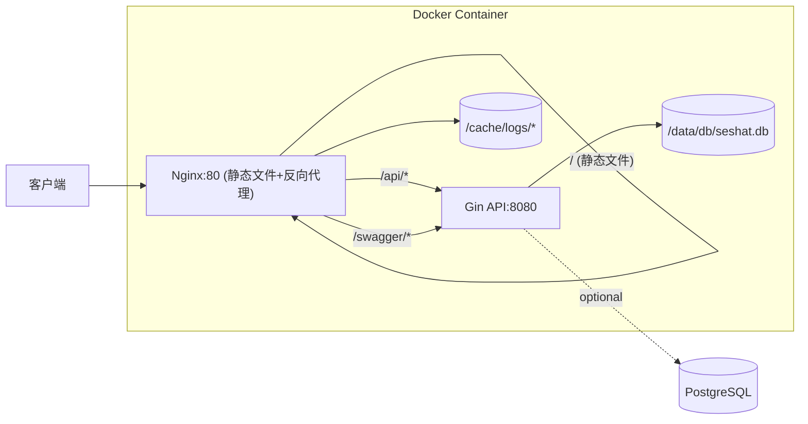

# Seshat 模板工程技术方案

## 项目概述

创建一个全栈模板工程，前端使用 React + Vite + Appica UI，后端使用 Go + Gin，最终打包为单一 Docker 镜像部署。

> [!IMPORTANT]
> 工程名 `basegoapp` 仅在以下位置声明，便于后期修改：
> - `go.mod` 中的 module 名称
> - 前端 `package.json` 中的 name 字段
> - Docker 相关配置

---

## 技术栈

| 层级 | 技术选型 | 说明 |
|------|----------|------|
| **前端框架** | React 19 + Vite | SPA 静态构建，路由页面按需加载 |
| **UI 框架** | Appica UI + Tailwind CSS 4 | 可访问的 React 组件与原子化样式 |
| **前端状态** | TanStack Query + Zustand | 分离服务端缓存与客户端会话状态 |
| **后端框架** | Go + Gin | 高性能 HTTP 框架 |
| **API 文档** | Swaggo/swag | 从代码注释自动生成 Swagger 文档 |
| **数据库** | SQLite（默认）/ PostgreSQL（可选） | 默认开箱即用，可切换到 PostgreSQL |
| **ORM** | GORM | Go 语言 ORM 框架 |
| **认证** | JWT Bearer Token | 令牌存于前端 LocalStorage，通过 Authorization 头发送，后端校验 token_version |
| **容器化** | Docker + Nginx | 静态文件 + API 反向代理 |

---

## 工程代码结构

```
basegoapp/
├── frontend/                    # 前端 React + Vite 项目
│   ├── vite.config.ts
│   ├── package.json
│   ├── src/
│   │   ├── api/                # API 封装与 Swagger 生成客户端
│   │   ├── components/         # 通用组件、布局与数据表格
│   │   ├── features/           # 业务 hooks
│   │   ├── pages/              # 首页、认证、个人中心、管理页
│   │   ├── router/             # React Router 与权限守卫
│   │   └── stores/             # Zustand 状态
│   └── public/
│
├── backend/                     # 后端 Go 项目
│   ├── go.mod
│   ├── go.sum
│   ├── main.go                 # 入口文件
│   ├── config/
│   │   └── config.go           # 配置管理
│   ├── internal/
│   │   ├── handler/            # HTTP 处理器
│   │   │   ├── auth.go         # 认证相关接口
│   │   │   └── user.go         # 用户相关接口
│   │   ├── middleware/
│   │   │   └── jwt.go          # JWT 中间件
│   │   ├── model/
│   │   │   └── user.go         # 用户模型
│   │   ├── repository/
│   │   │   └── user.go         # 数据访问层
│   │   ├── service/
│   │   │   └── auth.go         # 业务逻辑层
│   │   └── router/
│   │       └── router.go       # 路由配置
│   ├── pkg/
│   │   ├── database/
│   │   │   └── postgres.go     # 数据库连接（SQLite/PostgreSQL）
│   │   └── response/
│   │       └── response.go     # 统一响应格式
│   └── docs/                   # Swagger 生成的文档
│       ├── docs.go
│       ├── swagger.json
│       └── swagger.yaml
│
├── deploy/
│   ├── Dockerfile              # 多阶段构建
│   └── nginx.conf              # Nginx 反向代理配置
│
├── docker-compose.yml          # 本地开发环境
└── README.md
```

---

## 核心功能

### API 接口

| 接口 | 方法 | 路径 | 说明 |
|------|------|------|------|
| 注册 | POST | `/api/auth/register` | 用户注册 |
| 登录 | POST | `/api/auth/login` | 用户登录，返回 JWT |
| 初始化管理员 | POST | `/api/auth/setup-admin` | 使用一次性账户设置正式管理员凭据 |
| 退出 | POST | `/api/auth/logout` | 用户退出 |
| 修改密码 | PUT | `/api/user/password` | 修改当前用户密码 |
| 获取用户信息 | GET | `/api/user/profile` | 获取当前用户信息 |
| API 文档 | GET | `/swagger/*` | Swagger UI 文档 |

### 初始管理员

- 数据库为空时自动创建一次性 `admin/admin` 引导账户
- 引导账户登录后必须设置至少 6 位的正式管理员密码
- 初始化完成后默认密码立即失效，引导账户不能在初始化前访问业务和管理接口

### 密码策略

- 最小长度：6 位
- 无复杂度要求

### 安全增强

- CORS 默认允许任意 Origin，返回 `Access-Control-Allow-Origin: *`，不启用跨域凭据
- 登录令牌保存到前端 LocalStorage，并通过 `Authorization: Bearer <token>` 显式发送
- LocalStorage Token 需配合 XSS 防护和严格的 Content Security Policy
- 用户退出、改密和角色变更时递增 `token_version`，使旧 JWT 立即失效

---

## 部署架构



### Nginx 路由规则

- `/` → 静态文件（Vite SPA 构建，未命中路由回退到 `index.html`）
- `/api/*` → 后端 Gin API
- `/swagger/*` → Swagger 文档

### 数据与缓存目录

- `/data/db/seshat.db` → 默认 SQLite 数据库文件
- `/cache/logs/nginx/` → Nginx 日志
- `/cache/logs/app/` → 应用日志预留目录
- `/cache/tmp/` → 临时文件和运行时缓存

### 数据库模式

- 默认模式：`DB_DRIVER=sqlite`，无需 PostgreSQL，数据库文件位于 `/data/db/seshat.db`
- PostgreSQL 模式：设置 `DB_DRIVER=postgres` 和 `DATABASE_URL`，可使用外部数据库或 `docker compose --profile postgres up -d`
