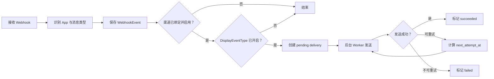

# 推送通知功能方案

## 1. 目标与边界

Seshat 为不同 App 的 Webhook 消息提供可配置的外部通知能力：

- 每个接入实例最多绑定一个推送渠道。
- 推送渠道支持 Webhook、Telegram、Apprise、邮箱、Server酱、Bark、DingTalk、Feishu、WhatsApp 和 WxPusher。
- 每个接入实例按所属 App 的消息类型配置是否推送。
- App 的默认消息类型也必须单独配置；所有消息类型初始均为“不推送”。
- 只有渠道处于启用状态，且当前消息展示类型已开启推送时，才创建推送任务。
- 推送在后台异步执行，不延长外部 App 调用 Webhook 接口的响应时间。

首版不支持一个实例绑定多个渠道、不支持用户自定义消息模板、不推送原始 Webhook 正文。

当前 Registry 已注册通用 Webhook、GitHub、Jellyfin 和 Emby。Jellyfin 与 Emby 共用媒体库、播放、认证、用户、系统、插件和默认消息类型；不同来源事件先映射为统一的 `DisplayEventType`。通知规则本身不写死任何 App 或消息类型。

## 2. 核心规则

### 2.1 消息类型匹配

推送规则使用事件落库后的 `WebhookEvent.DisplayEventType`，不使用原始 `SourceEventType`：

1. App 已声明的类型使用对应类型代码，例如 Jellyfin 的 `media_added`、`media_deleted`。
2. 未声明的消息类型在现有接收流程中映射到 `AppDefinition.DefaultEventType`。
3. 当前默认类型为 `__default__`，页面显示为“其他消息（默认类型）”。
4. 默认类型与已知类型一样拥有独立推送开关。
5. 数据库不存在某个类型的开启规则时，一律视为“不推送”。

采用“缺省即关闭”的稀疏配置后，AppDefinition 新增消息类型时无需迁移历史接入实例，新类型会自动以关闭状态出现在设置页面；已删除的类型不参与匹配。

### 2.2 推送判定

收到并成功保存消息后，依次判断：

1. 接入实例是否启用。
2. 接入实例是否绑定推送渠道。
3. 推送渠道是否启用。
4. `DisplayEventType` 对应规则是否开启。
5. 当前事件与渠道是否已经创建过推送任务。

全部满足时创建一条待发送任务，否则仅保存 Webhook 消息，不产生通知。

### 2.3 渠道 Adapter 隔离

推送渠道采用注册表和独立 Adapter：

- 后端每个渠道独立负责配置清洗、完整校验、协议发送、签名和业务响应判断；注册表只按类型查找 Adapter。
- 队列、重试、HTTP/SMTP 传输、代理、DNS/IP 安全检查和标准通知消息属于共享基础设施，不包含渠道类型分支。
- 前端每个渠道独立提供默认字段、编辑回填、请求转换和表单组件；页面只管理公共字段并通过注册表渲染当前 Adapter。
- 新增渠道时只新增后端 Adapter、前端 Adapter 和各自注册项，不向共享发送器、服务或页面增加渠道专有 `switch/if`。
- 修改某个渠道必须运行全部渠道回归测试，确保其他渠道的配置和发送结果不变。

## 3. 数据模型

### 3.1 `notification_channels`

保存用户可复用的推送渠道。

| 字段 | 类型 | 说明 |
|------|------|------|
| `id` | uint | 主键 |
| `owner_id` | uint | 所属用户，建立索引 |
| `name` | string | 渠道名称，最长 100 字符 |
| `type` | string | `webhook`、`telegram`、`apprise`、`email`、`serverchan`、`bark`、`dingtalk`、`feishu`、`whatsapp`、`wxpusher` |
| `enabled` | bool | 是否允许实际发送，默认 `false` |
| `config` | JSON | 非敏感配置 |
| `secret_config` | JSON | Token、URL、认证头等敏感配置，API 不直接返回 |
| `last_test_status` | string | 最近测试状态 |
| `last_test_at` | time | 最近测试时间 |
| `last_test_error` | string | 最近测试失败摘要 |
| `created_at` / `updated_at` | time | 创建和更新时间 |

渠道可以被同一用户的多个接入实例复用，但每个接入实例只能选择一个渠道。渠道默认禁用，测试成功后由用户手动启用。

所有渠道的 `config` 均支持 `use_proxy` 布尔字段，默认 `false`。开启后，该渠道的测试通知和正式推送使用系统设置中的 HTTP 代理；系统未配置代理时发送失败并给出脱敏错误，不自动回退到直连。

敏感配置延续当前项目策略，以明文保存在业务数据库中，但通过 `json:"-"` 与专用响应 DTO 防止接口意外返回。页面编辑时显示“已配置”，更新请求未提供新值则保持原值，填写新值时按字段替换。

### 3.2 `app_integrations.notification_channel_id`

在 `app_integrations` 增加可空外键：

- `NULL`：未绑定渠道。
- 非空：绑定到当前实例所有者名下的一个渠道。
- 更新绑定时必须同时校验渠道与实例的 `owner_id`。
- 删除仍被实例引用的渠道时返回冲突错误，要求先解除绑定，避免静默停止通知。

### 3.3 `integration_notification_rules`

保存实例级消息类型开关。

| 字段 | 类型 | 说明 |
|------|------|------|
| `id` | uint | 主键 |
| `integration_id` | uint | 接入实例 ID |
| `event_type` | string | AppDefinition 中的消息类型代码或默认类型代码 |
| `enabled` | bool | 是否推送，默认 `false` |
| `created_at` / `updated_at` | time | 创建和更新时间 |

建立唯一索引 `(integration_id, event_type)`。保存设置时只保留 `enabled=true` 的规则也可以满足需求；查询配置时用 AppDefinition 的完整类型列表与数据库规则合并，缺失项返回 `false`。

### 3.4 `notification_deliveries`

保存实际推送任务与发送结果，作为重试队列和审计记录。

| 字段 | 类型 | 说明 |
|------|------|------|
| `id` | uint64 | 主键 |
| `event_id` | uint | Webhook 消息 ID |
| `integration_id` | uint | 接入实例 ID |
| `channel_id` | uint | 渠道 ID |
| `channel_name` | string | 创建任务时的渠道名称快照，渠道删除后仍可展示历史记录 |
| `channel_type` | string | 创建任务时的渠道类型快照 |
| `event_type` | string | 实际匹配的展示类型 |
| `status` | string | `pending`、`sending`、`succeeded`、`retrying`、`failed` |
| `attempt_count` | int | 已尝试次数 |
| `next_attempt_at` | time | 下次重试时间 |
| `last_status_code` | int | 下游 HTTP 状态码 |
| `last_error` | string | 脱敏后的错误摘要 |
| `sent_at` | time | 成功时间 |
| `created_at` / `updated_at` | time | 创建和更新时间 |

建立以下索引：

- 唯一索引 `(event_id, channel_id)`，防止重复 Webhook 导致重复通知。
- 调度索引 `(status, next_attempt_at)`，供后台 Worker 获取待发送任务。
- 查询索引 `(integration_id, created_at)` 和 `(channel_id, created_at)`。

## 4. 渠道配置

### 4.0 系统 HTTP 代理

管理员可在“系统管理 → 系统设置”中配置一个全局 HTTP/HTTPS 代理 URL，支持 URL UserInfo 形式的用户名和密码。代理地址以明文保存在 `system_settings.http_proxy_url`，但设置查询接口只返回是否已配置和去除用户名、密码后的展示地址。

- 每个渠道通过“使用系统 HTTP 代理”开关独立选择，默认关闭。
- 开关关闭时强制直连，不读取容器的 `HTTP_PROXY`、`HTTPS_PROXY` 等环境变量。
- 清空系统代理后，已开启代理的渠道不会静默直连，测试或发送会明确失败。
- 目标 URL 仍执行原有公网、私网、重定向与云元数据地址校验；代理服务器自身允许位于私有网络，但仍禁止 link-local 和已知云元数据地址。

### 4.1 Webhook

配置项：

- 目标 URL。
- 可选自定义请求头；Authorization、Token、Secret 等值视为敏感配置。
- 请求方法首版固定为 `POST`。
- 超时时间首版固定为 10 秒。

发送 JSON：

```json
{
  "type": "seshat.notification",
  "app": { "code": "jellyfin", "name": "Jellyfin" },
  "integration": { "id": 1, "name": "家庭媒体库" },
  "event": {
    "id": 101,
    "type": "media_added",
    "title": "新增媒体：示例电影",
    "summary": "电影已加入媒体库",
    "severity": "info",
    "received_at": "2026-08-08T10:00:00Z"
  }
}
```

首版不发送 `RawBody`，避免把上游敏感字段二次扩散。

### 4.2 Telegram

配置项：

- Bot Token（敏感）。
- Chat ID。
- 可选 Message Thread ID。
- 是否静默发送。

通过 Telegram Bot API 的 `sendMessage` 发送文本消息。正文由事件标准展示数据生成，使用安全转义后的 HTML 或纯文本，不直接拼接原始 Webhook 内容。

### 4.3 Apprise

配置 Apprise API Base URL、Config ID 和可选 Tag，调用 `/notify/{Config ID}`。Config ID 作为敏感配置保存，不通过查询接口返回；Tag 留空时推送到该 Config ID 下的全部服务。

统一发送 `title`、`body`、`type` 和 `format`。Seshat 的 `severity` 映射到 Apprise 的 `info`、`success`、`warning`、`failure`。

### 4.4 邮箱通知

- 配置 SMTP 主机、端口、连接加密、发件人、一个或多个收件人，以及可选的用户名和密码。
- 支持 STARTTLS、隐式 TLS 和不加密连接；不加密 SMTP 适用于可信的私有网络环境。
- 渠道启用系统代理时，通过 HTTP `CONNECT` 隧道连接 SMTP 服务，HTTP 与 HTTPS 代理均可使用。
- 邮件以 UTF-8 纯文本发送，标题和正文来自标准通知消息，不附加原始 Webhook 正文。

### 4.5 Server酱与 Bark

- Server酱保存 SendKey，兼容 Turbo `SCT...` 和 Server酱³ `sctp...` SendKey，分别请求对应官方地址。
- Bark 配置服务 Base URL、Device Key，以及可选分组和提示音；既可使用官方服务，也可使用自托管 Bark Server。
- 两种渠道都检查业务响应码，HTTP 成功但业务响应失败仍会记录为推送失败。

### 4.6 DingTalk 与 Feishu

- 配置自定义机器人 Webhook URL，以及可选签名密钥。
- DingTalk 使用 Markdown 消息；开启加签时将时间戳和 HMAC-SHA256 签名加入请求 URL。
- Feishu 使用文本消息；开启加签时将时间戳和 HMAC-SHA256 签名加入请求体。
- Webhook URL 和签名密钥均作为敏感配置，不通过查询接口返回。

### 4.7 WhatsApp

- 使用 WhatsApp Cloud API，配置 Graph API 版本、Access Token、Phone Number ID 和收件号码。
- 当前发送普通文本消息。必须满足 WhatsApp 的客户会话窗口要求；窗口之外需要改用已审核模板，本版本不会自动切换模板。
- Graph API Host 固定为 `graph.facebook.com`，Access Token 只通过 Bearer 请求头发送。

### 4.8 WxPusher

- 配置 AppToken，并至少配置一个 UID 或 Topic ID；多个目标可使用逗号、分号或换行分隔。
- 使用官方 `/api/send/message` 接口发送文本，并以业务响应 `code=1000` 作为成功条件。

## 5. 通知内容生成

发送层使用与渠道无关的标准通知消息：

```go
type NotificationMessage struct {
    Title    string
    Body     string
    Severity string
}
```

首版从 `WebhookEvent.Title`、`Summary` 和 `Severity` 生成，Webhook 载荷还包含 App、接入实例、消息 ID、展示类型和接收时间，不包含原始正文。渠道发送器只负责把统一消息转换成各自协议。

## 6. 接收与发送流程



事件与推送任务应在同一个业务数据库事务中保存，避免事件已落库但任务丢失。实际网络调用必须在事务提交后由 Worker 异步执行。

重复事件命中现有 `DedupeKey` 时不创建新任务；如果原任务失败，则继续使用原任务的重试状态。

## 7. 重试与发送策略

- 单次请求超时 10 秒。
- 最多尝试 5 次，建议间隔：1 分钟、5 分钟、15 分钟、1 小时、6 小时。
- HTTP `408`、`429` 和 `5xx` 可重试；`429` 优先遵循 `Retry-After`。
- 其他 `4xx` 直接失败，避免凭据错误持续请求。
- 进程启动时继续处理数据库中到期的 `pending/retrying` 任务。
- 每个 Worker 每秒最多领取 10 条并串行发送；领取时通过条件更新原子切换为 `sending`，避免多进程重复领取。进程启动时会恢复超过 1 分钟仍处于 `sending` 的中断任务。
- 发送结果使用 `notification` 作为业务日志 source，记录 delivery/event/channel ID、等级和脱敏错误，不记录 Token、完整目标 URL或通知正文。

## 8. API 设计

### 推送渠道

| 方法 | 路径 | 说明 |
|------|------|------|
| `GET` | `/api/notification-channels` | 查询当前用户的渠道 |
| `POST` | `/api/notification-channels` | 创建渠道，默认禁用 |
| `PUT` | `/api/notification-channels/:id` | 更新配置或启用状态 |
| `DELETE` | `/api/notification-channels/:id` | 删除未被绑定的渠道 |
| `POST` | `/api/notification-channels/:id/test` | 发送测试通知，不受 enabled 限制 |

### 实例通知设置

| 方法 | 路径 | 说明 |
|------|------|------|
| `GET` | `/api/webhooks/integrations/:id/notification-settings` | 返回渠道绑定和 App 完整消息类型开关 |
| `PUT` | `/api/webhooks/integrations/:id/notification-settings` | 原子更新一个渠道绑定和所有类型规则 |

`GET` 响应中的类型列表直接来自当前 AppDefinition，且必须包含默认类型：

```json
{
  "channel_id": 3,
  "channel_enabled": true,
  "event_types": [
    { "code": "media_added", "name": "新增媒体", "notify": true },
    { "code": "media_deleted", "name": "删除媒体", "notify": false },
    { "code": "__default__", "name": "其他消息", "is_default": true, "notify": false }
  ]
}
```

### 推送记录

| 方法 | 路径 | 说明 |
|------|------|------|
| `GET` | `/api/notifications/deliveries` | 查询最近发送记录，可按状态筛选 |
| `POST` | `/api/notifications/deliveries/:id/retry` | 手动重试失败任务 |
| `GET` | `/api/webhooks/events/:id/notification-status` | 查看单条消息的推送状态或未推送原因 |

所有接口使用现有 Bearer Token，且服务端必须按 `owner_id` 做资源隔离，不能只依赖前端隐藏入口。

## 9. 页面设计

左侧“主要功能”新增“推送渠道”，路由为 `/notification-channels`。

页面包含两个区域：

1. **渠道管理**
   - 展示渠道名称、类型、启用状态、绑定实例数和最近测试结果。
   - 支持新增、编辑、启停、测试和删除。
   - 根据渠道类型动态展示配置表单，敏感字段只显示“已配置/未配置”。
   - 每个渠道提供“使用系统 HTTP 代理”开关，渠道卡片显示当前代理状态。
2. **实例通知设置**
   - 列出当前用户的所有接入实例、App 类型、绑定渠道和已开启消息类型数量。
   - 点击“配置通知”打开侧边栏。
   - 侧边栏顶部只能选择一个渠道；下面根据 AppDefinition 展示消息类型开关。
   - 默认类型固定放在列表末尾并标记“未知类型将匹配此规则”。
   - 新实例、新类型和默认类型的开关均默认关闭。
   - 已绑定但渠道停用时显示提示，规则继续保留但不会发送。

接入实例卡片同步增加“通知设置”入口。消息详情页增加“推送状态”区块，显示未配置、未匹配、待发送、已成功或失败，不把“未配置/未匹配”写入 deliveries 表。

## 10. 安全约束

- 渠道凭据不通过列表或详情 API 明文返回，不写入接口日志、业务日志和发送错误。
- Telegram、Server酱、WhatsApp 和 WxPusher 只请求各自固定的官方 API Host。
- Webhook、Apprise、Bark、DingTalk 和 Feishu 属于服务端主动请求，必须防止 SSRF：校验协议和解析后的 IP，检查每次重定向，永久禁止 link-local 和云元数据地址。
- Webhook、Apprise 等可配置 URL 支持 HTTP/HTTPS 与私有网络目标，同时继续阻止链路本地、组播、未指定地址和已知云元数据地址。
- 限制响应读取长度，例如最多 32 KiB；错误记录只保存脱敏后的摘要。
- 页面和通知正文必须转义 HTML/Markdown，避免内容注入。
- 普通用户只能管理自己的渠道、实例、规则和发送记录；管理员权限不应隐式绕过所有权校验。

## 11. 可观测性

业务日志统一使用：

```go
logging.Info("notification", "推送发送成功", logging.Fields{
    "event_id": eventID,
    "integration_id": integrationID,
    "channel_id": channelID,
    "delivery_id": deliveryID,
})
```

- `INFO`：任务创建、测试成功、发送成功。
- `WARN`：可重试失败、渠道停用或配置暂不可用。
- `ERROR`：任务最终失败、数据库更新失败、发送器内部错误。
- `DEBUG`：任务领取和规则判定等调试信息，避免记录消息正文。

接口日志通过相同 Request ID 与业务日志关联；后台 Worker 没有 HTTP Request ID 时使用 delivery ID 作为主要关联字段。

## 12. 测试范围

- 规则匹配：已知类型、未知类型映射默认类型、新增类型默认关闭。
- 权限隔离：不能绑定、编辑或测试其他用户的渠道。
- 唯一绑定：一个实例只能绑定一个渠道，一个渠道可以被多个实例复用。
- 去重：同一事件和渠道只创建一个 delivery。
- 发送器：全部十种渠道的请求格式、签名、业务响应码、SMTP 参数和凭据脱敏。
- 重试：超时、`429`、`5xx`、永久 `4xx` 和进程重启恢复。
- SSRF：私网、loopback、link-local、DNS 重绑定和重定向校验。
- UI：默认开关关闭、渠道停用提示、敏感字段掩码、类型切换表单。

## 13. 建议实施顺序

1. 数据表、渠道 CRUD、实例规则 API 和权限校验。
2. 通知消息生成、delivery 事务和后台 Worker。
3. Webhook 发送器、重试策略和发送记录。
4. Telegram、Apprise、邮箱和第三方机器人发送器。
5. 推送渠道页面、实例配置侧边栏和消息详情状态。
6. 完整测试、文档和升级验证。

## 14. 外部协议参考

- [Telegram Bot API](https://core.telegram.org/bots/api)
- [Apprise API Endpoints](https://appriseit.com/api/endpoints/)
- [Apprise API Integrations](https://appriseit.com/api/integrations/)
- [Server酱 SendKey 与发送接口](https://sct.ftqq.com/docs/getting-started/sendkey/)
- [Bark Server API V2](https://github.com/Finb/bark-server/blob/master/docs/API_V2.md)
- [DingTalk 自定义机器人](https://open.dingtalk.com/document/orgapp/custom-robot-access)
- [Feishu 自定义机器人](https://open.feishu.cn/document/ukTMukTMukTM/ucTM5YjL3ETO24yNxkjN)
- [WhatsApp Cloud API 文本消息](https://www.postman.com/meta/whatsapp-business-platform/request/8gvd47s/send-text-message)
- [WxPusher 消息发送文档](https://wxpusher.zjiecode.com/docs/)
